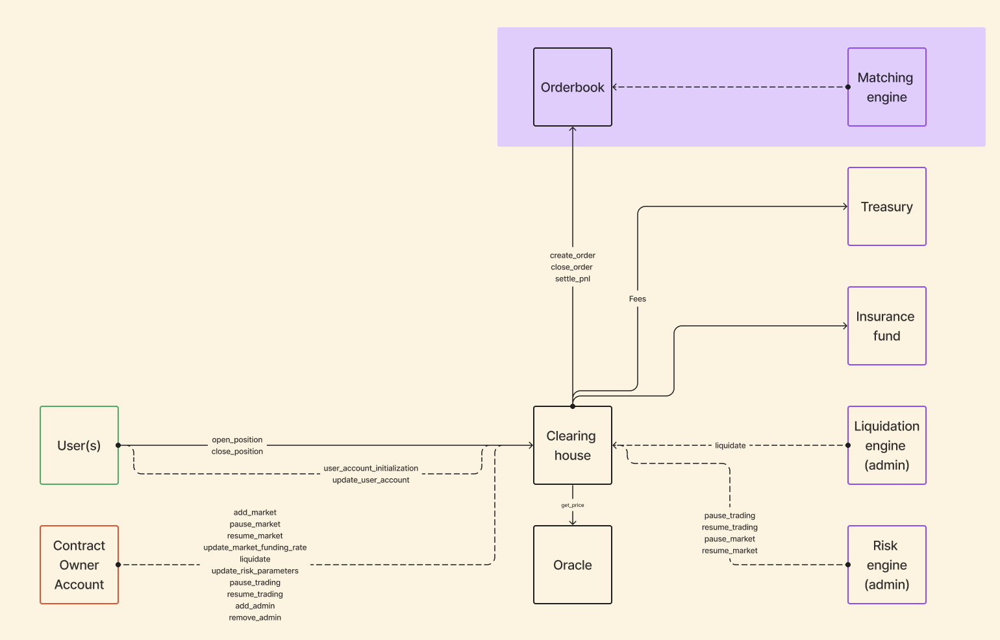

# Start Trading on Spark

To create an order on Spark, start by going to the Trade page at [http://app.allspark.gg](http://app.allspark.gg/). Next, select the desired asset pair from the options available in the right-hand block. If needed, you can use the Search tab to quickly find the desired asset pairs.\
\
To search for trading pairs, you can either enter a name or a token ID in the search bar. Additionally, you can narrow down your search by using the ETH, BTC, or USDC tabs to filter trading pairs. \
\
Keep in mind that you can mark a pair as a favorite by clicking on the star icon.\
\
.png>)

Once you have chosen the assets you want to trade, enter the desired amount of the token you want to sell or buy, along with the preferred price (by default, the price sets with the nearest market price). After entering the details, click the BUY/SELL button. You will then need to sign the created transaction to add the order to the smart contract's state.


Please note that while manual order creation is currently available on Spark, APIs for automated order creation with bots will be added at a later date. Once added, you can use these APIs to create orders programmatically and efficiently manage your trading strategies.


Once your order is placed, it will be available to be matched with other orders for the same asset pair and price amount. You can manage your open orders by clicking on the "Opened Orders" tab. From here, you can check the fulfillment percentage of your order or cancel the order by clicking the "Cancel" button.

<figure><figcaption></figcaption></figure>

That's it! With Spark's intuitive user interface and efficient trading infrastructure, you can easily create and manage your orders on the platform.
